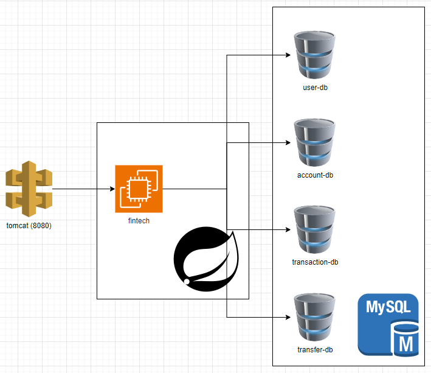
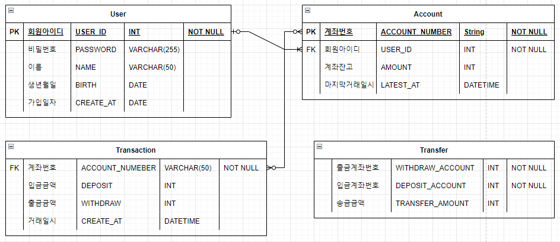

## 📝 프로젝트 주제

- 스프링 부트를 활용한 서버 API 기반 간단한 핀테크 프로젝트

## 🛢 프로젝트 구조

### 🔗 ERD

### ⚙ Tech Stack

- Language : `Java 17`
- Build : `Gradle`
- Database
  - RDB : `Mysql`
- Test : `Junit5`
- Login Token : `JWT`
- Test UI : `Swagger` `Postman`
- Server : `Tomcat v8.5`
- JDK : `JDK 17`
- Library : `Lombok`, `MySQL-Connector`

---

## 👦 회원가입과 로그인

### 회원가입

- [ ] 회원 가입 (아이디, 비밀번호, 이름, 생년월일)
- [ ] 유효성 검사 (기가입 아이디, 이름)

### 로그인

- [ ] 로그인 토큰 발행
- [ ] 로그인 토큰을 통한 제어 확인 (JWT, Filter를 사용해서 간략하게)
- [ ] 로그인 유효성 검사 (미가입 이메일, 비밀번호 비일치)

---

## 💵 계좌 관리 기능

### 계좌 관리

- [ ] 계좌 생성
- [ ] 계좌 삭제

### 계좌 금액 관리

- [ ] 계좌 금액 입금
- [ ] 계좌 금액 출금
- [ ] 계좌 입출금 내역 조회 (전체, 입금만, 출금만)

## 🔍 계좌 검색 기능

- [ ] 본인 계좌 검색

## 💸 계좌 송금 기능

- [ ] 계좌 송금
- [ ] 송금 내역 조회

---

## 📅 주차별 개발 계획

- 1주차 - 프로젝트 주제 선정 및 기능 구성
- 2주차 - 로그인, 회원가입 기능
- 3주차 - 계좌 관리, 검색 기능
- 4주차 - 계좌 금액 관리 기능
- 5주차 - 계좌 송금 기능

## ⚠ Trouble Shooting

[문제 해결 과정은 이 경로에서 확인할 수 있습니다.](doc/TROUBLE_SHOOTING.md)

---

