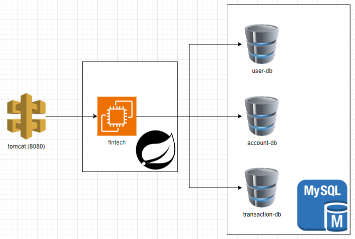
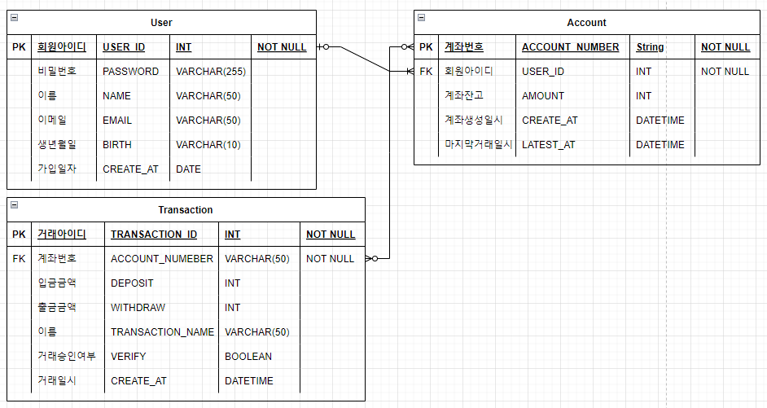

## 📝 프로젝트 주제

---

스프링 부트를 활용한 서버 API 기반 커머스 프로젝트

## 🛢 프로젝트 구조

---

### 🔗 ERD

---

### ⚙ Tech Stack

- Language : `Java 11`
- Build : `Gradle`
- Database
    - RDB : `Mysql` `MariaDB`
    - Non-Relation DBMS : `Redis`
- Test : `Junit5`
- Login Token : `JWT`
- Test UI : `Swagger` `Postman`
- Server : `Tomcat v8.5`
- JDK : `JDK 11`
- Library : `Lombok`, `Mariadb-Client`

## 👦 회원가입과 로그인

---

### 회원가입

- [ ] 회원 가입 (이메일, 이름, 생년월일, 비밀번호, 성별)
- [ ] 유효성 검사 (기가입 이메일, 이름)

### 로그인

- [ ] 로그인 토큰 발행
- [ ] 로그인 토큰을 통한 제어 확인 (JWT, Filter를 사용해서 간략하게)
- [ ] 로그인 유효성 검사 (미가입 이메일, 비밀번호 비일치)

### 관리자

- [ ] 관리자 로그인
- [ ] 상품 등록
- [ ] 상품 삭제
- [ ] 회원 관리

## 🔍 상품명 검색 기능

---

### 상품 검색

- [ ] 로그인 여부와 관계없이 상품 검색

### 상품 상세 조회

- [ ] 상품 상세 조회 (상품명, 가격, 제조사 등)

## 🛒 상품 장바구니 기능

---

- [ ] 상품 담기 (로그인 여부 확인)
- [ ] 장바구니 목록 (본인 장바구니 조회)
- [ ] 장바구니 삭제

## 주차별 개발 계획

---

- 1주차 - 프로젝트 주제 선정 및 기능 구성
- 2주차 - 로그인, 회원가입 기능 구현
- 3주차 - 상품 검색, 상품 상세 조회
- 4주차 - 장바구니 상품 담기, 장바구니 조회
- 5주차 - 장바구니 상품 삭제, 관리자 로그인

## Trouble Shooting

[문제 해결 과정은 이 경로에서 확인할 수 있습니다.](doc/TROUBLE_SHOOTING.md)

---

